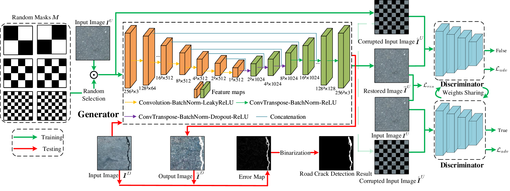

# DL project 2 report
We have implented a solution from this paper:
https://arxiv.org/abs/2401.15647

Architecture used:

The code is implemented in PyTorch. The training script is `train_generator.py`. The dataset is loaded from the folder structure using `DatasetFromFolder` class in `datasets/dataset.py`. The generator and discriminator models are defined in `models/model.py`.

The training uses a combination of losses including MSGMS loss, Perceptual loss, Style loss, and adversarial loss. The losses are defined in `utils/msgms_loss.py` and `utils/PS_loss.py`.

The training progress is logged using TensorBoard. The logs can be found in the specified directory when initializing the `SummaryWriter` in `train_generator.py`.

We modified the code to work with our dataset and adjusted hyperparameters as needed. We have changed the input/output image size to 448x448 and adjusted the number of filters in the generator and discriminator networks and number of checkboard masks.

We have tested many output binarization approaches, starting with bilateral filtering, and adding Otsu/adaptive thresholding, including a classifier (ResNet_18) into the pipeline, applying canny & distance transform before and after Otsu thresholding and trying different power transformations on distance transform output.

The best results were achieved with:
1. Bilateral filtering
2. Canny edge detection c1 = 100, c2 = 200
3. Distance transform, normalization to [0, 1], power transform with p = 0.8
4. Multiply bilateral filtered image with (1 - distance) transform result
5. Otsu thresholding
6. If classifier predicts no object, set all pixels to 0