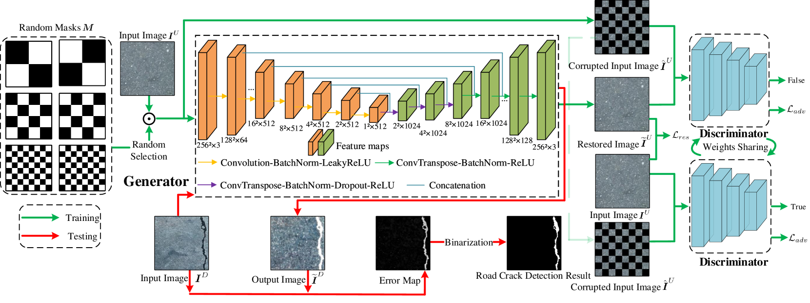
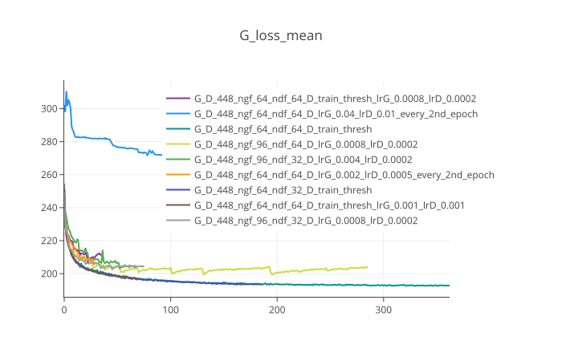
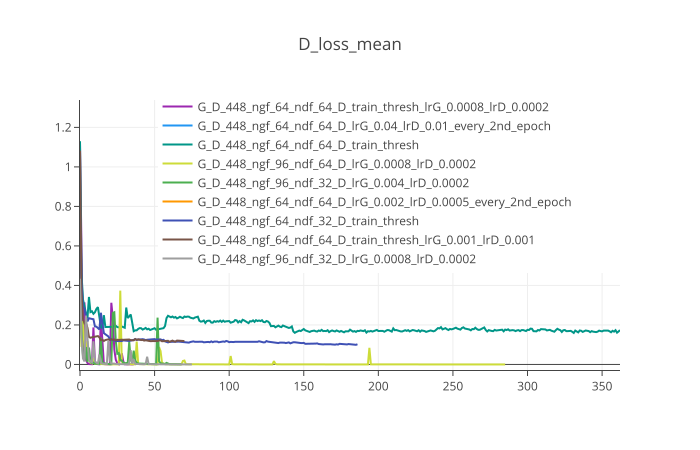
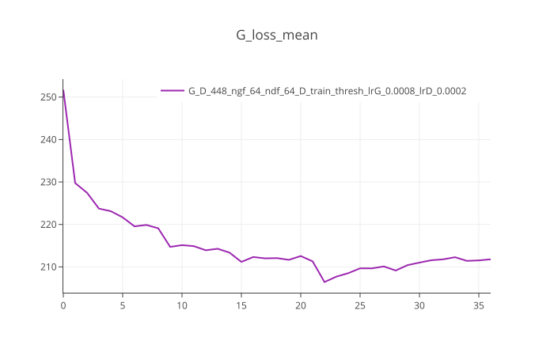
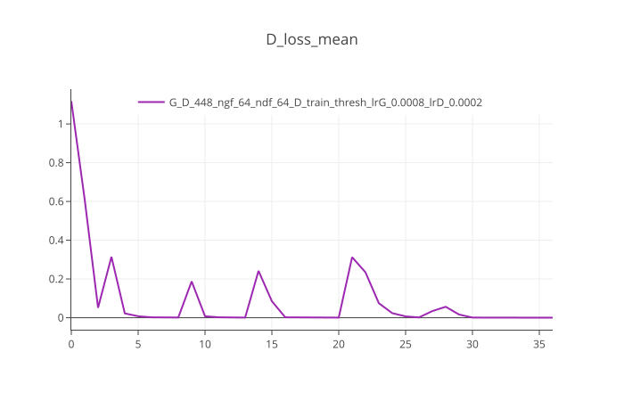

# DL project 2 report
We have implented a solution from this paper:
https://arxiv.org/abs/2401.15647

Architecture used:\


The code is implemented in PyTorch. The training script is `train_generator.py`. The dataset is loaded from the folder structure using `DatasetFromFolder` class in `datasets/dataset.py`. The generator and discriminator models are defined in `models/model.py`.

The training uses a combination of losses including MSGMS loss, Perceptual loss, Style loss, and adversarial loss. The losses are defined in `utils/msgms_loss.py` and `utils/PS_loss.py`.

The training progress is logged using TensorBoard. The logs can be found in the specified directory when initializing the `SummaryWriter` in `train_generator.py`.

We modified the code to work with our dataset and adjusted hyperparameters as needed. We have changed the input/output image size to 448x448 and adjusted the number of filters in the generator and discriminator networks and number of checkboard masks.

## Binarization approach

We have tested many output binarization approaches, starting with bilateral filtering, and adding Otsu/adaptive thresholding, including a classifier (ResNet_18) into the pipeline, applying canny & distance transform before and after Otsu thresholding and trying different power transformations on distance transform output.

The best results were achieved with:
1. Bilateral filtering
2. Canny edge detection c1 = 100, c2 = 200
3. Distance transform, normalization to [0, 1], power transform with p = 0.8
4. Multiply bilateral filtered image with (1 - distance) transform result
5. Otsu thresholding
6. If classifier predicts no object, set all pixels to 0

The results are summarized in `results.csv`.

We have chosen the `bilater_otsu_after_combining_w_edges_and_classifier_p0.8_c1100_c2200` approach as the best one.

Pipeline of scripts:
```bash
uv run train_generator.py [params]
uv run test_generator.py [params] // generates Generator outputs
uv run scripts/img_binarization.py [params] // applies the binarization pipeline
uv run scripts/calculate_errors.py [params] // calculates metrics and outputs results.csv
```

## Model optimization

We have tried different number of filters in the generator and discriminator networks, different learning rates and different number of epochs.
The best results were achieved with:
- Generator filters multiplier: 64
- Discriminator filters multiplier: 64
- Generator learning rate: 0.0008
- Discriminator learning rate: 0.0002

### Training curves




There are three generators achieving similar losses, but the one with the best binarization results is neither of them. We have chosen the G_D_64_64_lrG0.0008_lrD0.0002 model as the best one based on binarization results.
##### This model's training curve is shown below for clarity:




We can see that the model stops learning after around 30 epochs, discriminator loss is 0.0 from that point on. This issue could be addressed by setting a threshold for discriminator loss, below which we would stop updating discriminator weights.
This approach was implemented in different models, whose training was more stable, but the binarization results were worse (see train_thresh models).

## Results

The best results were achieved with the `bilater_otsu_after_combining_w_edges_and_classifier_p0.8_c1100_c2200` binarization approach.
Crack pixels are treated as positive class.
| F1  | IoU  |  Pr  |  Re  | Acc  |
|-----|------|------|------|------|
|0.2607|0.1990|0.2096|0.7067|0.8318|